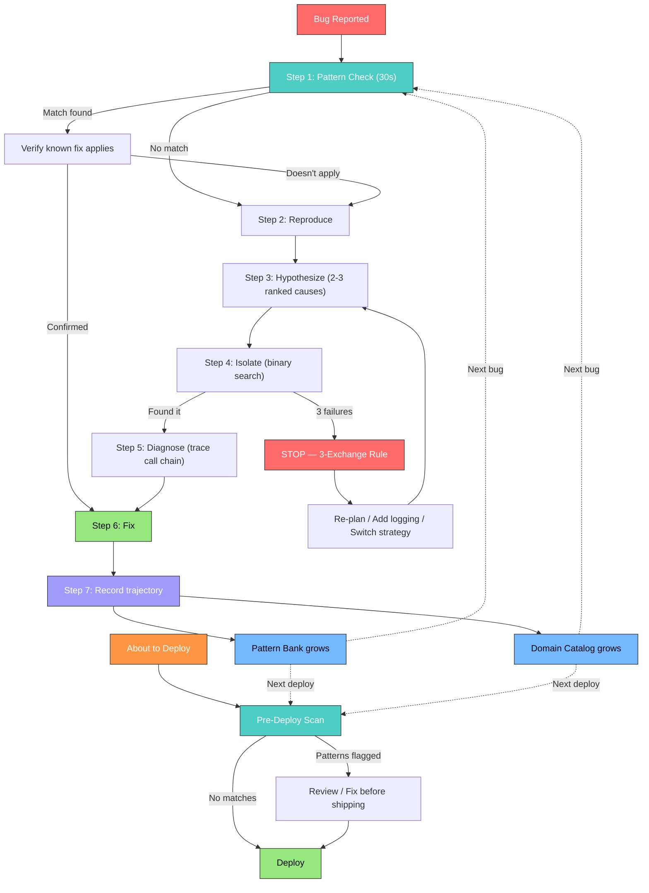

# Debug Bank

[](LICENSE)
[](https://github.com/soleimanmansouri/debug-bank/pulls)
[](https://claude.ai/claude-code)
[](https://github.com/openai/codex)
[](https://github.com/google-gemini/gemini-cli)
[](https://cursor.sh)

**Give your AI coding agent a memory that learns from failure.**

AI agents repeat the same mistakes because they forget everything between sessions. Debug Bank fixes this — a pattern-first debugging memory that checks "have I seen this before?" in 30 seconds instead of re-investigating for hours, and catches known failure patterns before they ship.

> **One-liner:** Drop a `CLAUDE.md` into your project. Your agent never makes the same debugging mistake twice.

```bash
curl -O https://raw.githubusercontent.com/soleimanmansouri/debug-bank/main/CLAUDE.md
```

---

## How It Works



Three layers that compound over time:

| Layer | What It Does | How It Helps |
|-------|-------------|--------------|
| **Pattern Bank** (P01-P21+) | Generalized root cause patterns | 30-second match before hours of investigation |
| **Domain Catalogs** | Bugs organized by subsystem | Search by symptom type, not by date |
| **Feedback Rules** | User corrections → enforceable rules | Agent adapts to YOUR working style |
| **Pre-Deploy Scanner** | Scans git diff against pattern keywords before shipping | Catches known failure classes before they reach production |

## The Problem This Solves

AI coding agents are expensive debugging partners:

- **They re-investigate bugs they've seen before** — from scratch, every time
- **They circle through 5+ failed attempts** before finding root causes
- **They can't learn from corrections** — "I told you this yesterday" doesn't stick
- **They have no pattern recognition** — a P08 (Config Chain Gap) looks brand new every time

Stack Overflow data: AI-generated code has **2.66x more formatting problems** and **1.5-2x more security bugs** than human code. Much of this comes from agents not learning from past failures.

Google's [ReasoningBank research](https://arxiv.org/abs/2504.09762) proved that distilling failures into reusable patterns yields **+8.3% on WebArena** and **+4.6% on SWE-Bench**. Debug Bank is the production-ready implementation of that concept.

## Quick Start

### Claude Code (Drop-in)

```bash
curl -O https://raw.githubusercontent.com/soleimanmansouri/debug-bank/main/CLAUDE.md
```

### Claude Code (Skills)

```bash
cp -r skills/debug-trajectory ~/.claude/skills/
cp -r skills/pattern-check ~/.claude/skills/
```

### Codex CLI / Gemini CLI

```bash
cp AGENTS.md /path/to/your/project/
cp -r patterns/ /path/to/your/project/patterns/
```

### Cursor

```bash
cat CLAUDE.md >> /path/to/your/project/.cursorrules
```

Works in **30 seconds**. No dependencies. No infrastructure. Just markdown files your agent reads.

## The 3-Exchange Stop Rule

The single most impactful rule in this repo:

> **If 3 rounds of iterative fixing show no progress: STOP.** Re-plan from scratch, add logging, or switch strategy entirely.

This prevents the #1 failure mode of AI agents — circular debugging that wastes tokens and produces nothing. After switching strategy, the counter resets.

## Pre-Deploy Pattern Scanner

Before a bug ships is the cheapest time to catch it. The pre-deploy scanner scans your `git diff` against the 21 pattern keywords and flags any matches before you deploy.

**What it does:**
- Greps the staged diff for keywords linked to each pattern (e.g., `observer`, `subscribe`, `multiple writers`, `fallback`, `retry`)
- Prints a ranked list of flagged patterns with their quick-check
- Exits non-zero when matches are found, so it can block a deploy pipeline

**Run it manually:**

```bash
bash integrations/pre-deploy-check.sh
```

**Hook it into Claude Code** — so it runs automatically before every deploy action. See the full setup guide:

```
integrations/claude-code-pre-deploy.md
```

**Example output:**

```
[debug-bank] Pre-Deploy Pattern Scan
Scanning git diff for known failure patterns...

  FLAGGED  P03 Observer/Hook Multiplier
           keyword: subscribe
           Check: Deduplicate by event/frame ID

  FLAGGED  P08 Config Resolution Chain Gap
           keyword: fallback
           Check: Trace the full fallback chain

2 pattern(s) flagged. Review before deploying.
Exit code: 1
```

No flagged patterns means a clean scan — the script exits 0 and the deploy proceeds.

## 22 Battle-Tested Patterns

Each pattern has: description, 30-second check list, real-world examples, fix strategy, prevention guide.

### Code Structure
| ID | Pattern | Quick Check |
|----|---------|-------------|
| P01 | [Wrapper/Decorator Default Mismatch](patterns/P01-wrapper-defaults.md) | Audit ALL parent class defaults when wrapping |
| P03 | [Observer/Hook Multiplier](patterns/P03-observer-multiplier.md) | Deduplicate by event/frame ID |
| P05 | [Context-Dependent Flag Duality](patterns/P05-flag-duality.md) | Check if any context needs the opposite value |
| P20 | [Filler/Background Audio Pipeline Contention](patterns/P20-filler-pipeline-contention.md) | Ensure only one source writes to the audio pipeline at a time |
| P21 | [Untested Handler Path After Shared Code Change](patterns/P21-untested-handler-path.md) | Test ALL handlers in files you changed, not just the one you edited |

### Data Integrity
| ID | Pattern | Quick Check |
|----|---------|-------------|
| P02 | [Multiple Write Sources → Corruption](patterns/P02-multiple-writers.md) | Grep for ALL writes to the same target |
| P09 | [Auto-Apply Pipeline Writing Feedback as Data](patterns/P09-auto-apply-corruption.md) | Validate payload matches target field structure |

### Configuration
| ID | Pattern | Quick Check |
|----|---------|-------------|
| P07 | [Stale/Dead Config](patterns/P07-stale-config.md) | Trace where runtime actually reads from |
| P08 | [Config Resolution Chain Gap](patterns/P08-config-chain-gap.md) | Trace the full fallback chain |
| P10 | [Contradictory Multi-Source Config](patterns/P10-contradictory-config.md) | Validate ALL sibling fields match provider |

### Dependencies
| ID | Pattern | Quick Check |
|----|---------|-------------|
| P06 | [Dependency Resolution Cascade](patterns/P06-dependency-cascade.md) | Check lock file after adding any dependency |

### Platform Quirks
| ID | Pattern | Quick Check |
|----|---------|-------------|
| P11 | [Credential Expression Scope Limitation](patterns/P11-credential-scope.md) | Test credential expressions with echo/log |
| P12 | [Expression Engine Corrupts Non-JSON Bodies](patterns/P12-expression-corruption.md) | Use JSON-based APIs in workflow engines |
| P13 | [Parse Code Matches Errors as Success](patterns/P13-parse-error-collision.md) | Check for error indicators BEFORE extracting data |
| P14 | [Expression Evaluation Requires Prefix](patterns/P14-expression-prefix.md) | Add prefix if template renders as literal |
| P15 | [Multi-Output Node Rejects Valid Returns](patterns/P15-multi-output-broken.md) | Use parallel single-output nodes |
| P16 | [Binary Data Is Reference-Based](patterns/P16-binary-reference.md) | Use helper methods to read actual data |

### LLM / AI Agents
| ID | Pattern | Quick Check |
|----|---------|-------------|
| P04 | [LLM Copies Example Text as Behavior](patterns/P04-llm-copies-examples.md) | No action-like text in prompts |
| P17 | [Model Speaks Everything in Context](patterns/P17-context-spoken.md) | Keep speakable text out of conversation history |
| P18 | [Model Loops Without Stop Signal](patterns/P18-loop-without-stop.md) | Set precise timeouts, add idempotency guards |
| P19 | [Prompt Engineering Has Hard Limits](patterns/P19-prompt-hard-limits.md) | Switch to code-level after 2 failed prompt fixes |
| P22 | [Iterative Fix Regression (Failswitch)](patterns/P22-iterative-fix-regression.md) | STOP after 2 failed fixes — deep analyze before attempt 3 |

## Scenarios — Multi-Service Debugging Challenges

Single-file bugs are for practice. Real production bugs span services, databases, and timing boundaries. The `scenarios/` directory contains self-contained L3-L4 debugging environments where the symptom is in one place and the root cause is somewhere else entirely.

| # | Name | Tier | Patterns | Key Challenge |
|---|------|------|----------|---------------|
| S01 | [Stale Cache Race](scenarios/S01-stale-cache-race.md) | L4 | P02 + P08 | Cache invalidation arrives after consumer reads stale data |
| S02 | [Retry Storm Amplification](scenarios/S02-retry-storm-amplification.md) | L4 | P06 + P03 | Library upgrade changes retry defaults, cascading across services |
| S03 | [Silent Schema Drift](scenarios/S03-silent-schema-drift.md) | L3 | P07 + P02 + P13 | Migration runs but service reads stale schema cache |

Each scenario includes: system architecture, red herrings, full investigation path, solution, and blast-radius analysis. See [scenarios/README.md](scenarios/README.md) for the full guide.

## Postmortems — Learning From Production Incidents

Anonymized postmortem reports from real incidents. Each goes beyond "what broke" to cover timeline, false leads, blast radius, and — most importantly — systemic mitigation that prevents the entire CLASS of incident.

| # | Title | Duration | Impact | Patterns |
|---|-------|----------|--------|----------|
| PM01 | [The Invisible Throttle](postmortems/PM01-invisible-throttle.md) | 4.5 hours | 12% of requests silently degraded | P07 + P13 |
| PM02 | [Midnight Migration](postmortems/PM02-midnight-migration.md) | 2 hours | Full outage + 30 min data loss | P02 + P08 |
| PM03 | [The Helpful Retry](postmortems/PM03-helpful-retry.md) | 35 minutes | $23K in duplicate charges | P06 + P03 |

See [postmortems/README.md](postmortems/README.md) for the template and writing guide.

## Compositions — When Patterns Combine

Real bugs rarely match a single pattern. Compositions document common pattern pairings, why they amplify each other, and how to detect the combination.

| ID | Composition | Patterns | Signal |
|----|------------|----------|--------|
| C01 | [Write Race + Stale Fallback](compositions/C01-write-race-stale-fallback.md) | P02 + P08 | Intermittent stale data that self-heals then re-breaks |
| C02 | [Upgrade Cascade + Retry Multiplier](compositions/C02-upgrade-cascade-retry-multiplier.md) | P06 + P03 | Traffic amplification after dependency update |
| C03 | [Silent Success + Stale Config](compositions/C03-silent-success-stale-config.md) | P13 + P07 | Wrong results, no errors, 100% "success" rate |
| C04 | [LLM Hallucination + Missing Stop](compositions/C04-llm-hallucination-missing-stop.md) | P04 + P18 | AI agent loops wrong behavior confidently |
| C05 | [Prompt Limits + Flag Duality](compositions/C05-prompt-limits-flag-duality.md) | P19 + P05 | Prompt fix breaks opposite context |

See [compositions/README.md](compositions/README.md) for investigation strategies.

## Difficulty Tiers

The protocol scales with the bug's scope. Use the [Difficulty Tiers guide](protocol/difficulty-tiers.md) to right-size your investigation:

| Tier | Scope | Time Budget | Example |
|------|-------|-------------|---------|
| **L1** | Single file | 5-30 min | Off-by-one, wrong variable, missing null check |
| **L2** | Multi-file, single service | 30 min - 2 hours | Controller returns wrong data due to service layer bug |
| **L3** | Multi-service | 2-8 hours | Service A writes correctly, service B reads stale cache |
| **L4** | Distributed / timing | 4 hours - 2 days | Cache invalidation race, retry storm, eventual consistency violation |

## Feedback Rules — Your Agent Adapts to You

When you correct your agent, the correction becomes a persistent rule:

```markdown
---
name: no-mocking-database
type: feedback
---
Integration tests must hit a real database, not mocks.

**Why:** Prior incident where mock/prod divergence masked a broken migration.
**How to apply:** Any test file touching database operations.
```

The `Why` lets the agent judge edge cases instead of blindly following rules. After 30+ rules, the agent rarely needs the same correction twice.

## Project Structure

```
debug-bank/
├── CLAUDE.md                          # Drop-in for Claude Code
├── AGENTS.md                          # Cross-agent (Codex, Gemini CLI, Cursor)
├── protocol/
│   ├── debug-trajectory.md            # The 7-step protocol
│   ├── 3-exchange-rule.md             # When to stop and re-plan
│   ├── difficulty-tiers.md            # L1-L4 scale selector
│   └── feedback-capture.md            # Corrections → persistent rules
├── patterns/
│   ├── P01 through P22               # 22 battle-tested patterns
│   └── TEMPLATE.md                    # Add your own
├── compositions/                      # Common pattern combinations
│   ├── C01 through C05               # 5 documented compositions
│   └── README.md
├── scenarios/                         # Multi-service debugging challenges
│   ├── S01 through S03               # L3-L4 scenarios with full solutions
│   ├── TEMPLATE.md
│   └── README.md
├── postmortems/                       # Anonymized production incidents
│   ├── PM01 through PM03             # With blast radius + systemic mitigation
│   ├── TEMPLATE.md
│   └── README.md
├── memory/
│   ├── schema.md                      # Memory file format
│   ├── feedback-rules.md              # Behavioral rule structure
│   └── domain-catalogs.md             # Organizing bugs by subsystem
├── skills/
│   ├── debug-trajectory/SKILL.md      # Claude Code skill
│   └── pattern-check/SKILL.md        # Pre-investigation scan
├── examples/                          # 20 real bug trajectories
│   ├── voice-pipeline/
│   ├── api-integration/
│   └── config-management/
└── integrations/                      # Setup guides per agent
    ├── claude-code.md
    ├── codex-cli.md
    ├── gemini-cli.md
    ├── cursor.md
    ├── pre-deploy-check.sh            # Bash scanner: git diff → pattern keywords
    └── claude-code-pre-deploy.md      # Claude Code hook integration guide
```

## Why This Works

**Compound learning** — Every bug fix teaches the system. After 50 bugs, most issues resolve at Step 1 (pattern match).

**Transfers across projects** — P02 (Multiple Writers) and P08 (Config Chain Gap) appear in web apps, APIs, pipelines, and infrastructure. The pattern bank moves with you.

**User-driven self-improvement** — Feedback rules capture corrections with WHY context. The agent gets better at matching your expectations over time.

**Evidence-based** — Every pattern has a check list. Every catalog entry links to a pattern ID. Nothing is "just trust me."

## Research Foundation

| Research | Contribution | Impact |
|----------|-------------|--------|
| [Google ReasoningBank](https://arxiv.org/abs/2504.09762) (2025) | Distilling reasoning from successes AND failures | +8.3% WebArena, +4.6% SWE-Bench |
| [AgentDebug](https://arxiv.org/abs/2509.25370) (ICLR 2026) | Agent Error Taxonomy across 5 failure categories | +24% all-correct accuracy |
| Trajectory-based learning | Searchable, pattern-linked debug entries | Prevents repeat investigations |

## Contributing

**Add patterns:** Copy `patterns/TEMPLATE.md`, assign the next P-number, submit a PR with a real-world example.

**Add domain catalogs:** Create a directory under `examples/` with bug entries following `memory/domain-catalogs.md`.

**Share feedback rules:** The best rules include a clear `Why` that helps the agent judge edge cases.

## License

[MIT](LICENSE)

---

Built from months of production debugging across diverse software systems. Battle-tested on 100+ real bugs before being open-sourced.

Created by [Soleiman Mansouri](https://github.com/soleimanmansouri).
